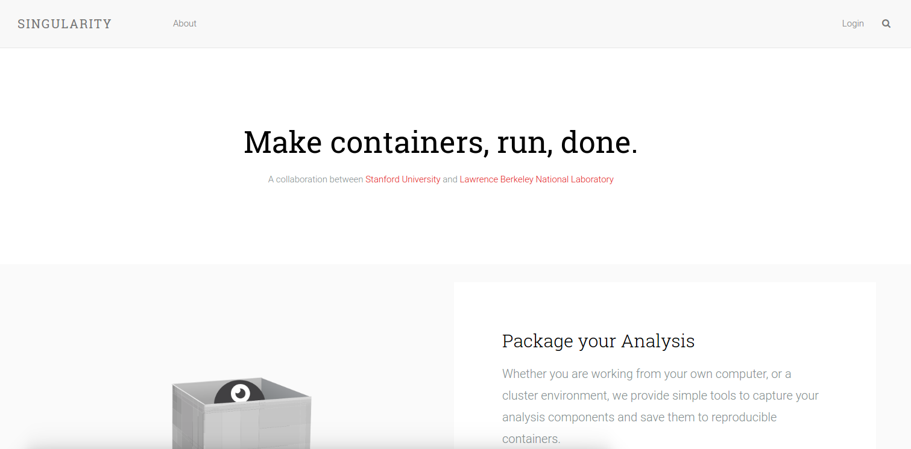
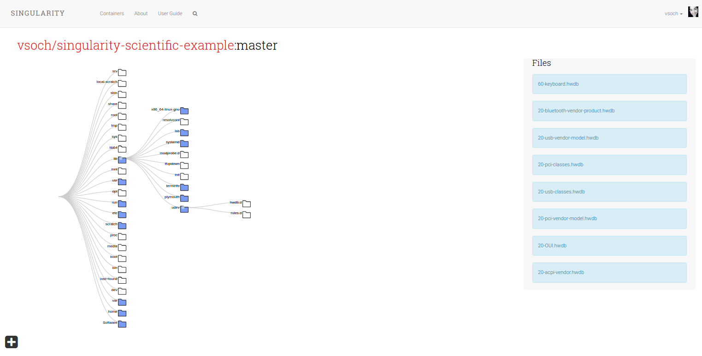
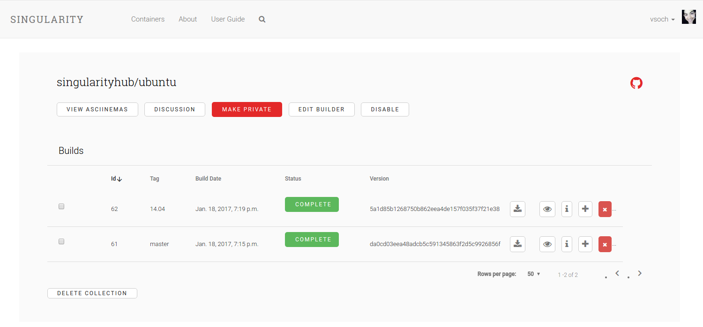
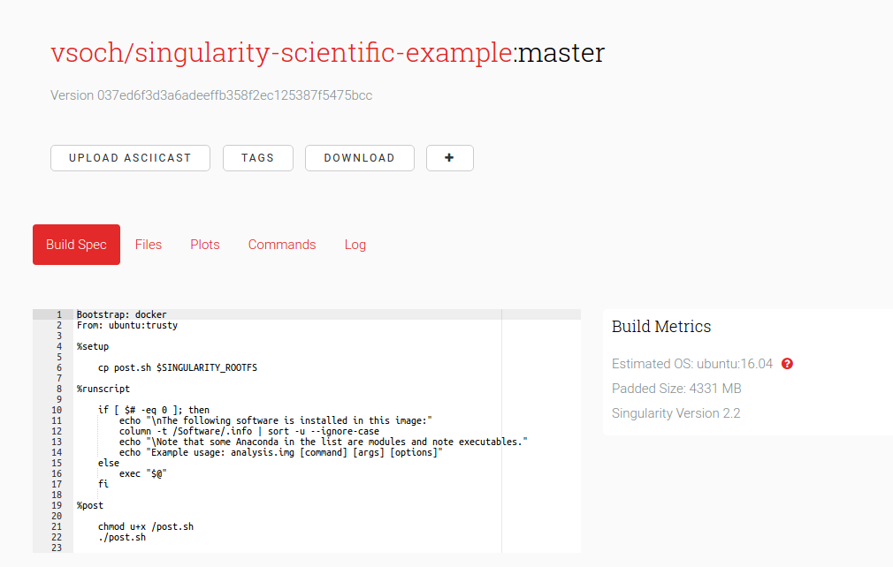

# Singularity Hub

## What is Singularity Hub?
Singularity Hub is a registry for [scientific containers](https://opensource.com/resources/what-are-linux-containers).

## What is a Linux Container?
A container image is an encapsulated, portalable environment that is created to distribute a scientific analysis or a general function. Containers help with reproducibility of such content as they nicely package software and data dependencies, along with libraries that are needed. Thus, the core of Singularity Hub are these Singularity container images, and by way of being on Singularity Hub they can be easily built, updated, referenced with a url for a publication, and shared. A Singularity container image is built from a specification text file named `Singularity`. If you are familiar with Docker, this file is akin to the [`Dockerfile`](https://docs.docker.com/engine/reference/builder/).



### Building Images
You can interact with Singularity Hub via the interface, Github repositories, and the Singularity command line tool. The general workflow is as follows:

   - create account on Singularity Hub, authentication with Github
   - connect a Github repo to a new image. This means creating a webhook that will trigger a new build at each push to the repo.
   - push the Singularity file to the repo to trigger the build
   - Singularity-Hub will be notified of the push via the webhook, and the spec file will be version controlled via the Github commit. This repo url, commit id, storage location, and some secrets are then sent to Singularity Hub builders.
   - the image is accessible programatically on Singularity Hub, and (soon) from the Singularity command line client.


- [Usage Documentation](https://github.com/singularityhub/singularityhub.github.io/wiki)
- [singularity software](https://singularityware.github.io)
- [singularity-hub.org](https://www.singularity-hub.org)
- [singularity global client](https://singularityhub.github.io/sregistry-cli)
- [Terms of Service](http://singularity-hub.org/terms)


Singularity Hub is developed at Stanford University with support from Google Cloud. Thank you!

## Citation
For complete details, please see our [recent manuscript](http://journals.plos.org/plosone/article?id=10.1371/journal.pone.0188511)

```
Sochat VV, Prybol CJ, Kurtzer GM (2017) Enhancing reproducibility in scientific computing: Metrics and registry for Singularity containers. PLoS ONE 12(11): e0188511. https://doi.org/10.1371/journal.pone.0188511
```

Please [tell us](https://www.github.com/singularityhub/singularityhub.github.io) about requests for features, or any questions that you might have.


### Look Inside
After a build is complete, you can look through the folder/file hierarchy of your image, right in the web interface. You can also add containers to your "Container Snackbox" by clicking on various `+` buttons around the site. From the snackbox you can select one or a pair of images to compare.



### A Container Collection
A container collection is associated with a Github repo, which will look for a file called `Singularity` in the base. Once a repo is connected to the hub, any new pushes will build a new image. Each image is version controlled with the commit, and you can define different tags for your images by pushing to different branches.




### A Container Build
All build specs, logs, and running commands are easily viewable, and copy pastable directly from the Hub. This gives containers a (programmatic) transparency, so you know how they were built.




### Reproducibility
Each build history, including the parameters for the cloud environment and builder, are stored, so you can go back and refer to any previous version. We will include more robust detail on this and all of the above in our upcoming manuscript.


## Get Help
- [Joining Singularity Slack](https://singularity-container.slack.com) is the quickest way to talk to the developers and other users.
- [Post an issue](https://www.github.com/singularityhub/singularityhub.github.io/issues) to this board for a question or issue about Singularity hub. If it pertains to a specific library image, please [find the image](https://singularity-hub.org/collections/library), click on the Github link, and post to it's board.
