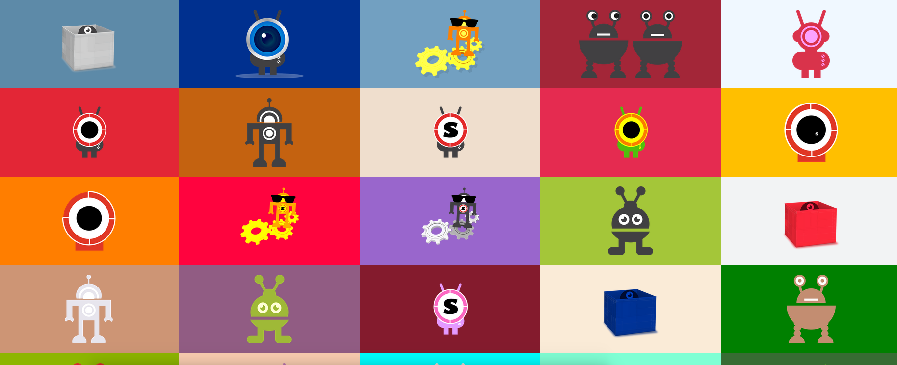

# Container Tools

Welcome to the container tools portal! 

 - See the [tools here](https://singularityhub.github.io).
 - Follow [@containertools](https://www.twitter.com/containertools) on Twitter.
 - If you need help, [post an issue](https://github.com/singularityhub/singularityhub.github.io/issues)

## What is a Linux Container?
A container image is an encapsulated, portalable environment that is created to distribute a scientific analysis or a general function. Containers help with reproducibility of such content as they nicely package software and data dependencies, along with libraries that are needed.

## What are the goals of Container Tools?
These are open source tools for scientific containers. The tools are designed with the primary
goal to serve the scientific community. Since [Singularity](https://singularityware.github.io) is 
a container technology that is friendly for shared computational resources common in the scientific community,
the majority of our tools use it. 

## Quick Links

### Container Management

 - [Tunel Interface](https://singularityhub.github.io/interface) for interactive container management.
   - Recipe converters from Dockerfile to Singularity and back
   - Local building, pulling
   - [Globus](https://singularityhub.github.io/interface/plugin-globus) integration 
 - [Global Client](https://singularityhub.github.io/sregistry-cli) for command line container management.
   - Clients include Google Compute, Drive, Storage, Dropbox, Globus, Singularity Hub, and Singularity Registry
   - *under development* integration of cloud [builders](https://singularityhub.github.io/sregistry-cli/client-google-compute).
 - [Singularity Registry](https://singularityhub.github.io/sregistry) server for institutions to deploy their own Singularity Container Registry.
   - *under development* security scanning with [Clair](https://github.com/coreos/clair).
   - *under development* integration with [Globus](https://www.globus.org)
   - *under development* integration of cloud [builders](https://singularityhub.github.io/sregistry-cli/client-google-compute).

### Building

 - [singularity-hub.org](https://www.singularity-hub.org) build service for Singularity containers from Github
   - [Documentation](https://github.com/singularityhub/singularityhub.github.io/wiki)
   - [Terms of Service](http://singularity-hub.org/terms)
 - [The Scientific Filesystem](https://sci-f.github.io) organizational format that supports exposure of executables and metadata for discoverability of applications in scientific containers.
 - [The Builders](https://singularityhub.github.io/sregistry-cli/client-google-compute) Deploy your own builders on Google Cloud
   - [builders (developers)](https://singularityhub.github.io/builders) develop a custom builder for the library

### Domain Specific

 - [The Experiment Factory](https://expfactory.github.io) Reproducible container-based experiments.

### Container Technology

- [singularity software](https://singularityware.github.io) The core Singularity software maintained by [sylabs](https://sylabs.io)

The Container Tools and Singularity Hub is developed at Stanford University with support from Google Cloud. Thank you!

# Citations

 - [Singularity Hub](http://journals.plos.org/plosone/article?id=10.1371/journal.pone.0188511).
 - [Singularity Registry](https://doi.org/10.21105/joss.00426)
 - [The Scientific Filesystem](https://doi.org/10.1093/gigascience/giy023)
 - [The Experiment Factory](https://doi.org/10.21105/joss.00521)

Please [tell us](https://www.github.com/singularityhub/singularityhub.github.io) about requests for features, or any questions that you might have.

## Get Help
- [Joining Singularity Slack](https://singularity-container.slack.com) is the quickest way to talk to the developers and other users.
- [Post an issue](https://www.github.com/singularityhub/singularityhub.github.io/issues) to this board for a question or issue about Singularity hub. If it pertains to a specific library image, please [find the image](https://singularity-hub.org/collections/library), click on the Github link, and post to it's board.
